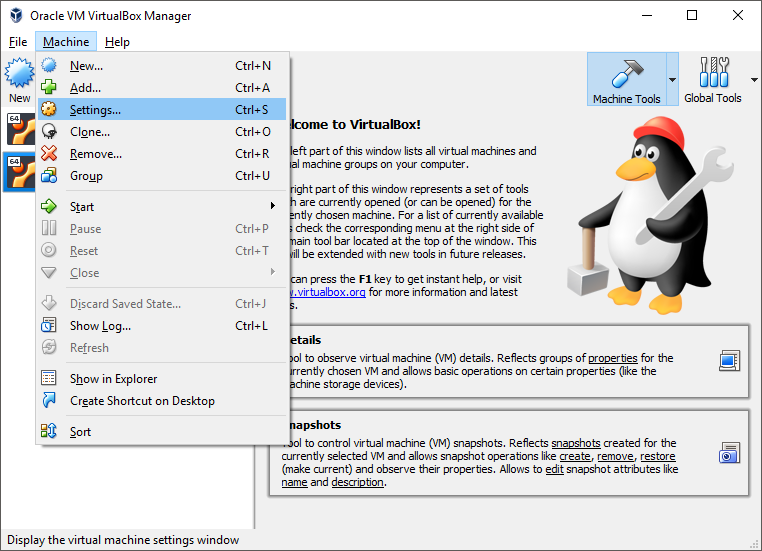
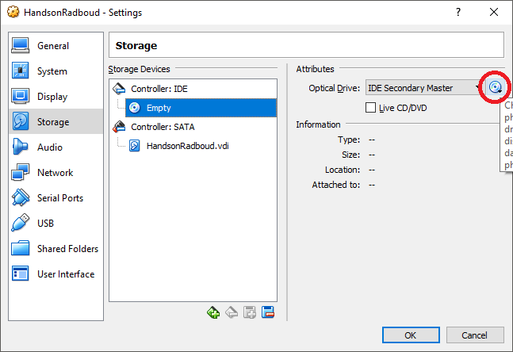
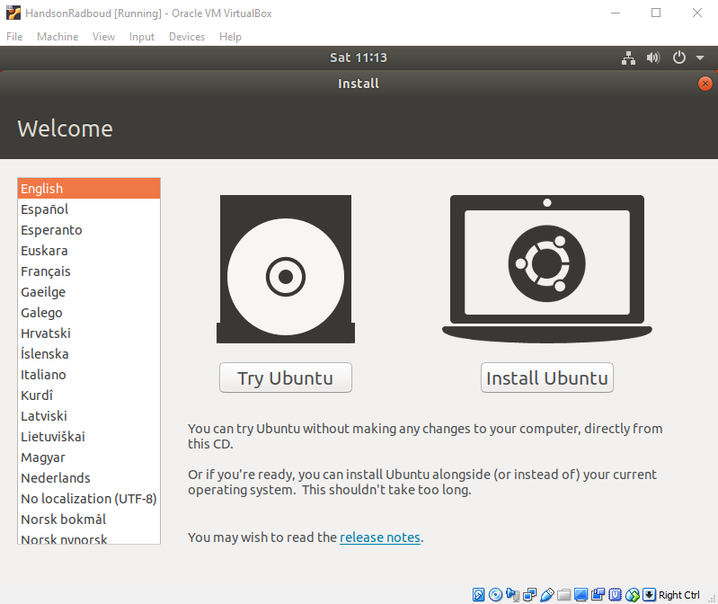
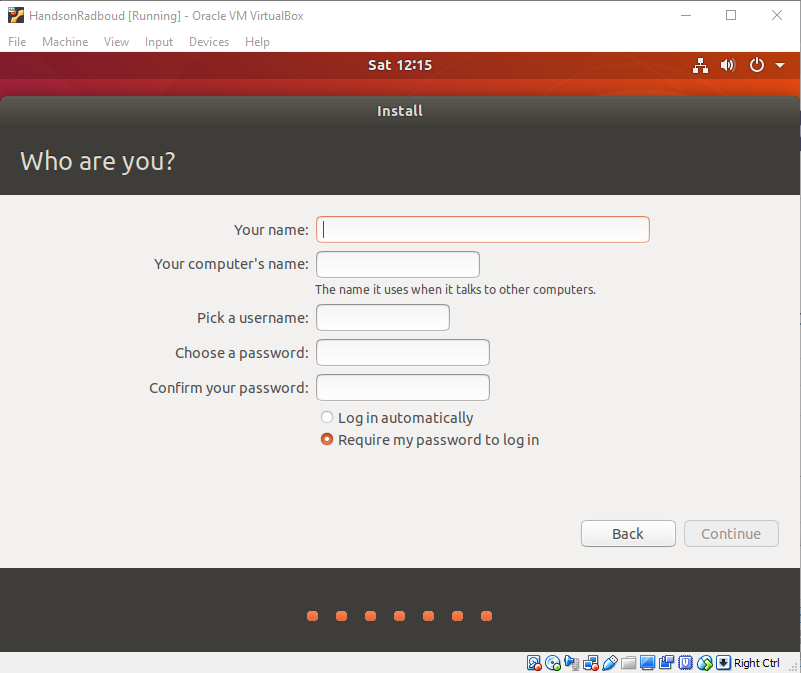
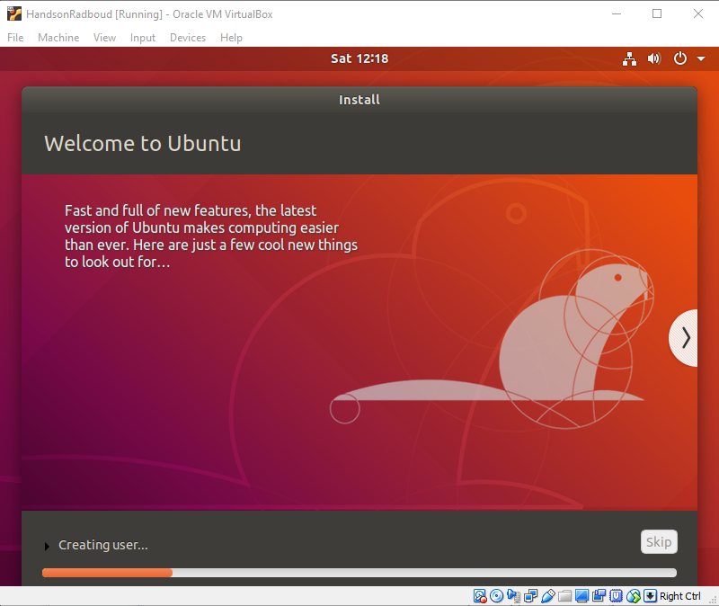
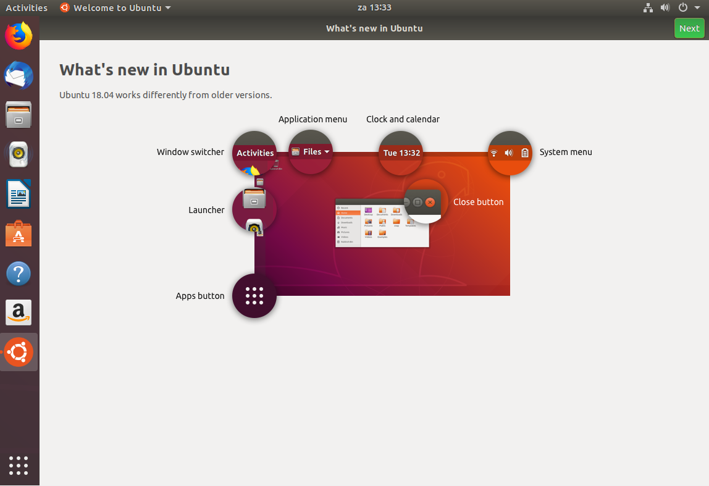

# 2. Installeren van Ubuntu 18.04.1

Nu de VM is opgezet voor Ubuntu gaan we het besturingssysteem zelf installeren. In het verleden stonden veel Linux distributies bekend als *complex om te installeren*. Tegenwoordig is dat wel anders. Dat zullen we ook zien tijdens de installatie van Ubuntu.

Als eerste moeten we zorgen dat de gedownloade ISO wordt herkend als een DVD in de VM. Daarvoor moeten we het instellingen scherm openen:

 

- In het kopje `Storage` kun je de beschikbare IDE controller selecteren. Vervolgens kun je op het knop rechtsklikken om de ISO te selecteren:

 

- Als je de Ubuntu ISO hebt geselecteerd kun je de VM opstarten door op de grote `Start`-knop te klikken.
- Wanneer je onderstaand scherm ziet klik dan op `Install Ubuntu` om het OS te installeren op de VM.

 

- Je kunt alle opties volgende klikken de default opties zijn goed genoeg (Uiteraard, als je dat leuk vind, kun je alle opties bekijken en een overwogen keuze maken ;) )
- Wanneer je onderstaand scherm krijgt kun je alles invullen (vergeet niet je wachtwoord anders kun je opnieuw beginnen)

 

- Ubuntu zal nu worden geïnstalleerd, tijdens de installatie zal hij ook alle benodigde updates binnenhalen. Afhankelijk van de netwerk snelheid kan dit even duren.

 

- Uiteindelijk zal de installatie vragen om opnieuw op te starten, doe dit.
- Als de VM opnieuw is opgestart zal je het inlog scherm zien, klik op je naam en vul je wachtwoord in.
- Je krijgt nu onderstaand scherm te zien.

 

- Klik een aantal keer op `next`, en uiteindelijk kom je op de desktop van de vers-geïnstalleerde Ubuntu 18.04.1.

>  :tomato: Ik ontvang graag feedback over deze sessie, je kunt het hier achterlaten: https://forms.gle/w3CG84JcDLm22fAT7

:thumbsup: Volgende hoofdstuk [Eerste kennismaking met Ubuntu](../kennismaking/) :fast_forward: